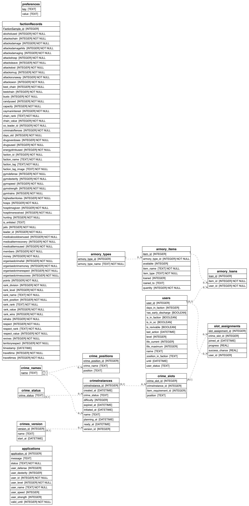

 

# TornHub
The data hub for all your Torn scripting needs in python with SQLite.

## How to use Torn hub

clone Torn hub into a folder on your machine and go through the setup process to install the dependencies. You need to run the code once to build the database and update it.  You will also get an up to date Scheam diagram and text file.

You can run the code and pass in you API key or just enter it when prompted.

Then pick a script and run it like this
'''clear; python3 demo.py --api_key=????????????''' 
* ```clear``` just clears your terminal so it is easy to read the results
* ```python3``` is the programming language app
* ```demo.py``` is the script file - you can write your own
* ```--api_key=????????????``` — replace the questionmarks with your own API key, or skip this and enter it when asked

# Setup

[Setup Instructions are in README_setup,md](./README_setup.md)

# Schema

 

# Views

The hub contains a number of views that join the main tables to make it easier to query the data. You can look at the schema and copy these to make you own queries or use them as a starting point and filter the results as you need.

* crimeInstance_cube              | A huge table of all the crimeInstances, role slots and assignments
* crime_name_positions_view       | Crime Names and positions for each are in two tables, this is a single view to help iterate
* crime_slot_assignments_view     | All assigned users and details

# Cache folder

This folder contains the JSON retrieved from Torn. Paged data will be combined into one file and topped up each time.

# Writing a script

See ```demo.py```

```python
import sqlite3 # db engine
from Torn.manageDB import initDB,DB_CONNECTPATH
from Torn.updateDB import updateDB
from tabulate import tabulate # optional support for outputing tables as text grids or HTML
```

```python
# Optional - you need to to these at least once but can run on stale data without them
initDB() # creates the database if not already done 
updateDB() # updates the Torn data using the API
```

Open a connection to the DB and get a cursor to use on it. Remember to commit the changes and close the connection or you can lose data and corrupt the DB file. 

```python
conn = sqlite3.connect(DB_CONNECTPATH)
cursor = conn.cursor()

# ... run your code ... 

comm.commit # Commit changes if make any
conn.close # Close the connection
```

Execute a command:
```Python
cursor.execute('''PRAGMA integrity_check;''')
```
Print all the results (cursor.fetchall()) in a simple layout with headers
```Python
# get the data for all rows
results = cursor.fetchall()
# read the column descriptions to use as the table heads in the top row
tableHeaders = [desc[0] for desc in cursor.description]
# generate a simple text table in a string
table =tabulate(results, headers=tableHeaders, tablefmt="simple")
# print it, or save it
print(table)
```
### Result
The integrity_check pragma returns one row containing its OK result (or raises an error)
```text
integrity_check
-----------------
ok
```

A simple query is easy.  You should test your SQL in the db browser program first.

```Python
# run a simple query
# this SELECTS some columns 
# FROM the sqlite_master table 
# but only WHERE a row matches the test and name does not begin with an underscore
# sort the results in order by column 1 then colum 2
cursor.execute('''
    SELECT type, name 
    FROM sqlite_master 
    WHERE name NOT LIKE '[_]%' 
    ORDER BY 1, 2
''')
# print the results in a grid
print(tabulate(cursor.fetchall(), headers= [desc[0] for desc in cursor.description], tablefmt="grid"))
```
### Result
```text
+--------+--------------------------------+
| type   | name                           |
+========+================================+
| index  | sqlite_autoindex_crime_names_1 |
+--------+--------------------------------+
| index  | sqlite_autoindex_preferences_1 |
+--------+--------------------------------+
| table  | crime_names                    |
+--------+--------------------------------+
| table  | crime_positions                |
+--------+--------------------------------+
| table  | crime_slots                    |
+--------+--------------------------------+
| table  | crimes                         |
+--------+--------------------------------+
| table  | faction_members                |
+--------+--------------------------------+
| table  | preferences                    |
+--------+--------------------------------+
| table  | slot_assignments               |
+--------+--------------------------------+
| table  | sqlite_sequence                |
+--------+--------------------------------+
| table  | users                          |
+--------+--------------------------------+
| view   | _rowCounts                     |
+--------+--------------------------------+
| view   | crime_name_positions_view      |
+--------+--------------------------------+
| view   | crime_slot_assignments_view    |
+--------+--------------------------------+
| view   | faction_members_view           |
+--------+--------------------------------+
```
Close gracefully
```Python
# Commit changes if make any
comm.commit 
# Close the connection
conn.close
```
